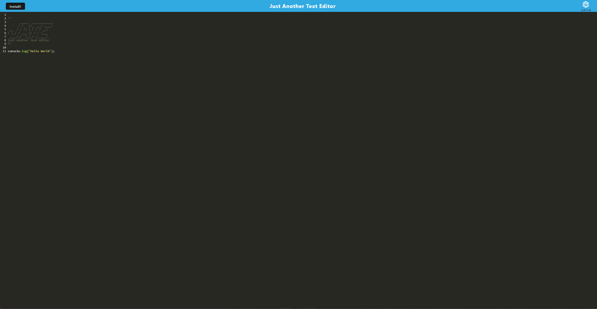

# Just Another Text Editor

[](https://opensource.org/licenses/MIT)

## Description
Just Another Text Editor is a single-page progressive web application where a user can create notes and/or code snippets with or without an internet connection. The application features a number of data persistence techniques which serve as redundancy in case the user's browser does not support one of the options. The user can retrieve their notes or snippets at any time for later use. Through the use of the integrated service worker as well as the cache APIs, it is guaranteed that the application will be fully functional with or without an internet connection. The user has the ability to access visited pages while offline.

## Table of Contents
- [Installation](#installation)
- [Usage](#usage)
- [Mockup](#mockup)
- [Contributing](#contributing)
- [GitHub](#github)
- [Email](#email)
- [Deployed Application](#deployed-application)

## Installation
The user navigate to ```Heroku link``` and use the application there. Additionally, once at the deployed application, the user can install the application and use it on their computer. 

## Usage
This application is meant to be used by anyone who would like a reliable place to store notes and code snippets.

## Mockup


## Contributing
Please email me to discuss contributing.

## GitHub
GitHub: https://github.com/caitlinramsey/progressive-web-applications-text-editor

## Email
Email: caitlinramsey@outlook.com

## Deployed Application
The deployed application can viewed [here]().